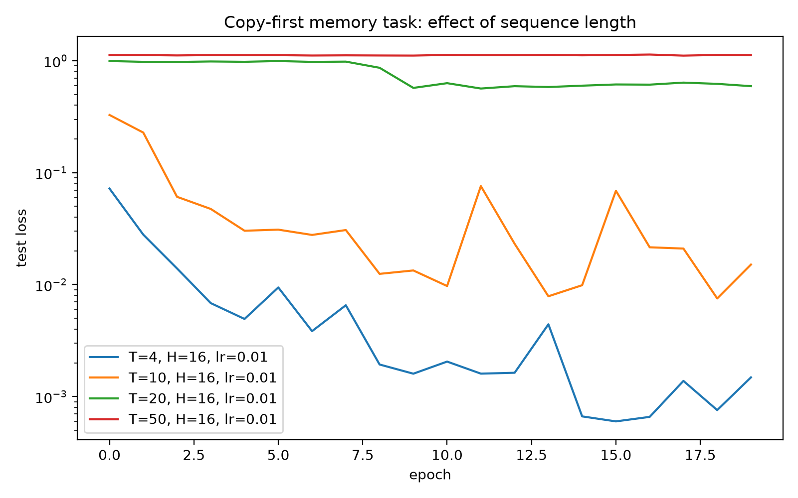
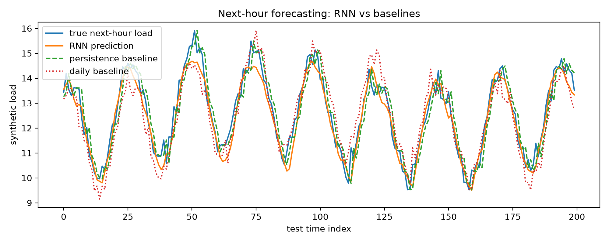
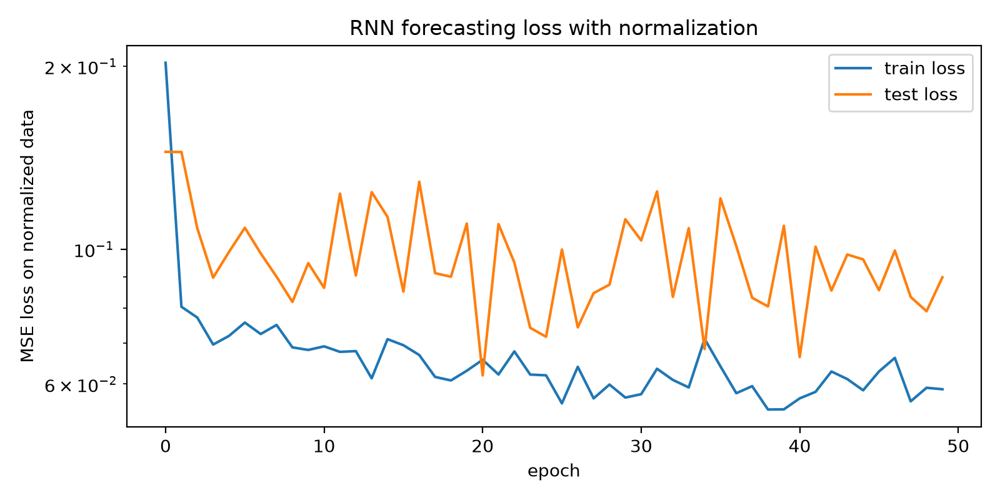

# Continuous-Time RNN Memory Kernels

Small numerical experiments on recurrent neural networks, time-series forecasting, and memory kernels.

This repository is motivated by my bachelor thesis on approximation and optimization theory for linear continuous-time recurrent neural networks. The goal is to build intuition for how recurrent models store information, how memory length affects training, and how continuous-time linear RNNs relate to kernel approximation.

## Results

### Copy-first memory task

The experiment shows how increasing sequence length makes it harder for an RNN to retain information.

<p align="center">
  
</p>

---

### Time-series forecasting

A simple recurrent neural network is trained for one-step-ahead forecasting and compared with common baselines.

<p align="center">
  
</p>

---

### Training loss

Training and test loss during optimization.

<p align="center">
  
</p>

## Project motivation

Recurrent neural networks process sequential data by maintaining a hidden state.

$$
h_t = \phi(W_x x_t + W_h h_{t-1} + b)
$$

This hidden state can be interpreted as a learned summary of the past.

For linear continuous-time RNNs, the model is

$$
\dot h_t = W h_t + Ux_t, \qquad \hat y_t = c^\top h_t
$$

Under suitable stability assumptions, this leads to a kernel representation.

$$
\hat y_t = \int_0^\infty c^\top e^{Ws} U x_{t-s}\,ds
$$

Thus, studying RNNs naturally leads to questions about memory, approximation, and optimization.

## Repository structure

```text
ct-rnn-memory-kernels/
├── experiments/
│   ├── 01_copy_first_memory.py
│   └── 02_rnn_time_series_forecasting.py
├── outputs/
│   └── figures/
├── src/
│   ├── kernels.py
│   └── losses.py
├── thesis_notes/
├── README.md
└── requirements.txt